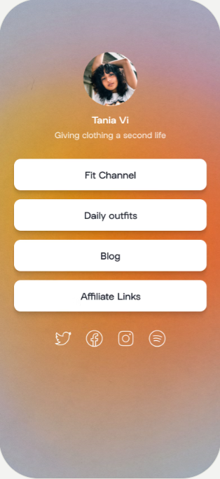

# Ulum Toyota Profile Page

This project is a Link-Tree like for Profile Page:

It is basically what is presented in the [Upstash + Next.js quickstart](https://docs.upstash.com/redis/tutorials/nextjs_with_redis), just with TypeScript, and some minimal UI with TailwindCSS.

## Table of Contents

- [Ulum Toyota Profile Page](#ulum-toyota-profile-page)
  - [Table of Contents](#table-of-contents)
  - [Techonology Used](#techonology-used)
  - [Screenshots](#screenshots)
  - [About The Creator](#about-the-creator)
  - [LICENSE](#license)

## Techonology Used

- TypeScript
- [Upstash](https://upstash.com/)
- [TailwindCSS](https://tailwindcss.com/)

## Screenshots

## About The Creator

Hello there 👋🏻, my name is [Afif Abdillah Jusuf](https://github.com/bungambohlah) and I'm a software engineer.

I'm currently working as a [Full Stack Developer](https://linkedin.com/in/afifjusuf).

Graduated from [Politeknik Elektronika Negeri Surabaya](https://pens.ac.id) as Associate Degree in Informatics Engineering.

Nice to meet you.

Visit my personal site at [afif.dev](https://afif.dev).

## LICENSE

This project is open-sourced software licensed under the [MIT license](https://opensource.org/licenses/MIT).
